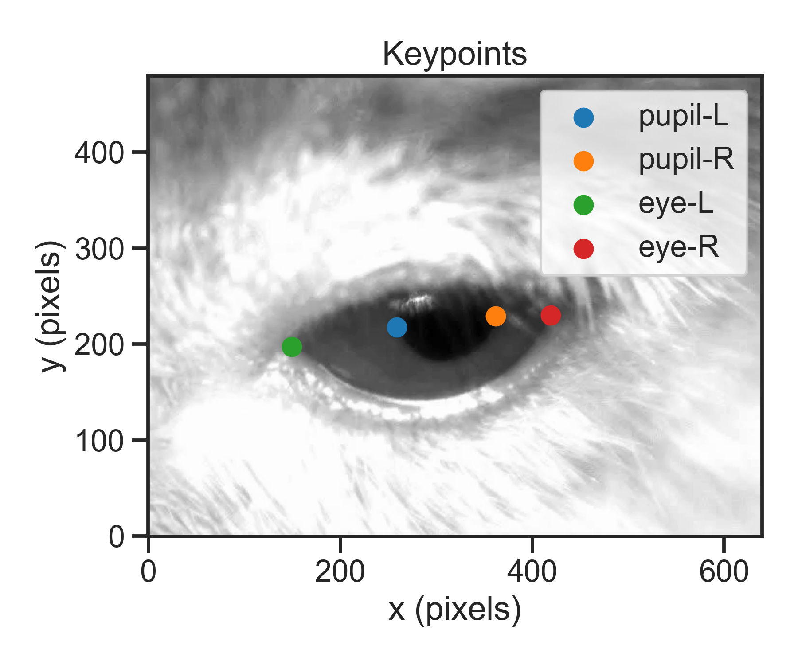

## whoami

- Neuroscientist & Research Software Engineer 🧠🐭💻
- [Neuroinformatics Unit](https://neuroinformatics.dev), [Sainsbury Wellcome Centre](https://www.sainsburywellcome.org/web/), UCL
- Fellow of the [Software Sustainability Institute](https://www.software.ac.uk/)
- Lead developer of [movement](https://movement.neuroinformatics.dev)

::: {.callout-tip appearance="simple" icon=false} 
##  Find me online

 [niksirbi](https://github.com/niksirbi) |
 [\@niksirbi\@neuromatch.social](https://neuromatch.social/@niksirbi) |
  [nikosirmpilatze.com](https://nikosirmpilatze.com)
:::

## Measuring behaviour as movement {.smaller}

Defining behaviour is tricky, but many have tried.

> The total movements made by the intact animal [@tinbergen_study_1951].

::: {.fragment}
We can quantify *movements* through various tools:

- 🎥 **Video cameras**
- 📱 Inertial measurement units (IMUs)
- 🛰️ GPS-based biologgers
:::

## From videos to motion {.smaller}

::: {layout="[[30, 35, 35]]" layout-valign="bottom"}

::: {.fragment fragment-index=1}

:::

::: {.fragment fragment-index=1}

:::

::: {.fragment fragment-index=2}
 [@mathis_deeplabcut_2018]](img/MousereachGIF.gif)
:::

:::


## Markerless pose estimation

::: {layout="[[45, 55]]" layout-valign="center"}


 [@pereira_sleap_2022]](img/sleap_video.gif)

:::


## Animal behaviour 🤝 computer vision {.smaller}


{height="250"}
  
::: {.fragment}
{.absolute top=100 right=20  height="400"}
:::


## What happens after tracking? {.smaller}


{height="250px"}

::: {.incremental}
- Lack of standardised data formats and tools
- Lots of fragile 'in-house' scripts
- Piles of un-analysed data
:::


## movement: overview {.smaller}

{fig-align="center"}

::: footer
[movement.neuroinformatics.dev](https://movement.neuroinformatics.dev/)
:::

## The movement dataset

::: {.r-stack}
::: {.fragment .fade-in-then-out fragment-index=1}
{fig-align="center"}
:::
::: {.fragment fragment-index=2}
{fig-align="center"}
:::
:::

::: {.r-stack}
::: {.fragment .fade-in-then-out fragment-index=1}
```{.python code-line-numbers="3-4"}
from movement.io import load_dataset

ds = load_dataset("/path/file.h5", source_software="DeepLabCut", fps=30)
id0_position = ds.position.sel(individuals="id_0")
```
:::
::: {.fragment fragment-index=2}
```{.python code-line-numbers="3-4"}
from movement.io import load_dataset

ds = load_dataset("/path/file.csv", source_software="VIA-tracks", fps=30)
id0_position = ds.position.sel(individuals="id_0")
```
:::
:::

::: footer
[movement.neuroinformatics.dev/latest/user_guide/movement_dataset.html](https://movement.neuroinformatics.dev/latest/user_guide/movement_dataset.html)
:::

## 

<iframe src="https://movement.neuroinformatics.dev/latest/user_guide/input_output.html" title="movement Input/Output guide" style="max-height: 110%; max-width: 125%; width: 125%; height: 110%; transform: scale(0.8); transform-origin: top left;"></iframe>

::: footer
[movement.neuroinformatics.dev/latest/user_guide/input_output.html](https://movement.neuroinformatics.dev/latest/user_guide/input_output.html)
:::

## Cleaning data


{height="300px" fig-align="center"}


::: {.fragment}
```{.python code-line-numbers="3|4"}
from movement.filtering import rolling_filter, interpolate_over_time

ds["position"] = rolling_filter(ds.position, window=5, statistic="median")
ds["position"] = interpolate_over_time(ds.position, max_gap=3)
```
:::


::: footer
[movement.neuroinformatics.dev/latest/api/movement.filtering.html](https://movement.neuroinformatics.dev/latest/api/movement.filtering.html)
:::

## Simple plots

::: {layout="[[50, 50]]"}

::: {.fragment fragment-index=1}

:::

::: {.fragment fragment-index=2}

:::

:::

::: {.r-stack}
::: {.fragment .fade-in-then-out fragment-index=1}
```{.python code-line-numbers="3"}
from movement.plots import plot_centroid_trajectory

plot_centroid_trajectory(ds.position, individuals="mouse1")
```
:::
::: {.fragment fragment-index=2}
```{.python code-line-numbers="3"}
from movement.plot import plot_occupancy

plot_occupancy(ds.position, individuals="mouse1", norm="log")
```
:::
:::

::: footer
[movement.neuroinformatics.dev/latest/api/movement.plots.html](https://movement.neuroinformatics.dev/latest/api/movement.plots.html)
:::

## movement kinematics


::: {layout="[[20, 40, 20]]"}

::: {.fragment fragment-index=1}

:::

::: {.fragment fragment-index=1}

:::

::: {.fragment fragment-index=2}

:::

:::


::: footer
[Sample data](https://movement.neuroinformatics.dev/user_guide/input_output.html#sample-data): __Elevated Plus Maze__ from *Loukia Katsouri* | __Pupil Tracking__ from *Sepi Keshavarzi*.
:::


## movement kinematics {.smaller}

Compute variables derived from `position` data:

```{.python code-line-numbers="8|9|10-14|15-20"}
from movement.kinematics import (
    compute_speed,
    compute_path_length,
    compute_pairwise_distances,
    compute_forward_vector,
)

speed = compute_speed(ds.position)
path_length = compute_path_length(ds.position)
body_length = compute_pairwise_distances(
    ds.position,
    dim="keypoints",
    pairs={"snout": "tail_base"},
)
forward_vector = compute_forward_vector(
    ds.position,
    left_keypoint="left_ear",
    right_keypoint="right_ear",
    camera_view="top_down",
)
```

::: aside
See [movement.neuroinformatics.dev/latest/api/movement.kinematics.html](https://movement.neuroinformatics.dev/latest/api/movement.kinematics.html)
:::

##

<iframe src="https://movement.neuroinformatics.dev/latest/examples/index.html" title="movement examples" style="max-height: 110%; max-width: 125%; width: 125%; height: 110%; transform: scale(0.8); transform-origin: top left;"></iframe>

::: footer
[movement.neuroinformatics.dev/latest/examples](https://movement.neuroinformatics.dev/latest/examples/index.html)
:::

## movement GUI {.smaller background-color="black"}



::: footer
[Sample data](https://movement.neuroinformatics.dev/user_guide/input_output.html#sample-data): __Octagon__ from *Ann Duan's Lab*.
:::

## Community adoption {.smaller}

-  ~80k downloads (PyPI + conda-forge)
-  34 code contributors |  ~330 merged pull requests
-  External packages depending on `movement`:

::: {layout="[[60, 20, -20]]" layout-valign="bottom" .fragment}
](img/VAME.gif)

](img/lisbet_logo_dark.png)
:::


## The bigger picture

::: {.r-stack}

{width="1000px"}

::: {.fragment}
{width="1000px"}
:::

:::

## The even bigger picture {.smaller}

*Long-term vision:* `movement` as the *scikit-image* for animal motion data.

{height="420px"}

::: {.fragment}

::: {.callout-tip appearance="simple"} 
If you prefer the R ecosystem, check out the [animovement](https://animovement.github.io/animovement/) toolbox
by [Mikkel Roald-Arbøl](https://roald-arboel.com).
:::

:::

## Acknowledgements {.smaller}

::: {.r-stack}

{width="1000px"}

::: {.fragment}
{width="1000px"}
:::

:::


::: footer
[movement.neuroinformatics.dev/latest/community/people](https://movement.neuroinformatics.dev/latest/community/people.html)
:::


## Join the movement!

-  [movement.neuroinformatics.dev](https://movement.neuroinformatics.dev/)
-  [github.com/neuroinformatics-unit/movement](https://github.com/neuroinformatics-unit/movement)
-  [neuroinformatics.zulipchat.com > movement](https://neuroinformatics.zulipchat.com/#narrow/stream/406001-Movement)

::: {.fragment}

::: {.callout-tip appearance="simple" icon=false} 
## Animals in Motion

Annual week-long workshop, part of **Open Software Summer School**.

-  [animals-in-motion.neuroinformatics.dev](https://animals-in-motion.neuroinformatics.dev/dev/)
-  [neuroinformatics.dev/open-software-summer-school/](https://neuroinformatics.dev/open-software-summer-school/)
:::

:::

## Easy Installation

```{.bash code-line-numbers="1,4|2,5|7"}
conda install -c conda-forge movement
conda install -c conda-forge movement napari pyqt6

pip install movement
pip install movement[napari]

movement launch
```

-  Package available on PyPI and conda-forge
-  |  |  Works across OSes 
-  No dedicated GPU required

::: aside
See [full installation guide.](https://movement.neuroinformatics.dev/latest/user_guide/installation.html)
:::


## References {.smaller}

::: {#refs}
:::
