## Measuring behaviour as movement {.smaller}

Defining behaviour is tricky, but many have tried.

> The total movements made by the intact animal [@tinbergen_study_1951].

::: {.fragment}
We can quantify *movements* through various tools:

- 🎥 **Video cameras**
- 📱 Inertial measurement units (IMUs)
- 🛰️ GPS-based biologgers
:::

## From videos to motion {.smaller}

::: {layout="[[30, 35, 35]]" layout-valign="bottom"}

::: {.fragment fragment-index=1}
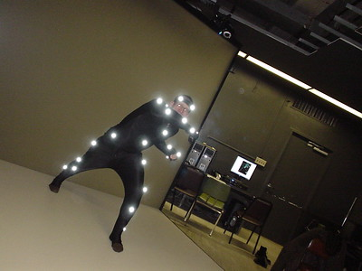
:::

::: {.fragment fragment-index=1}
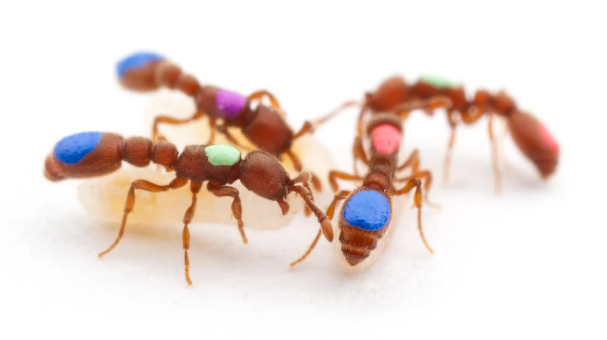
:::

::: {.fragment fragment-index=2}
 [@mathis_deeplabcut_2018]](img/MousereachGIF.gif)
:::

:::


## Markerless pose estimation

::: {layout="[[45, 55]]" layout-valign="center"}


 [@pereira_sleap_2022]](img/sleap_video.gif)

:::


## Animal behaviour 🤝 computer vision {.smaller}


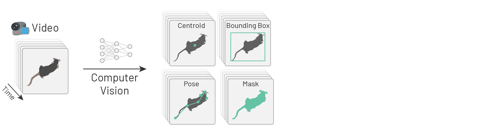{height="250"}
  
::: {.fragment}
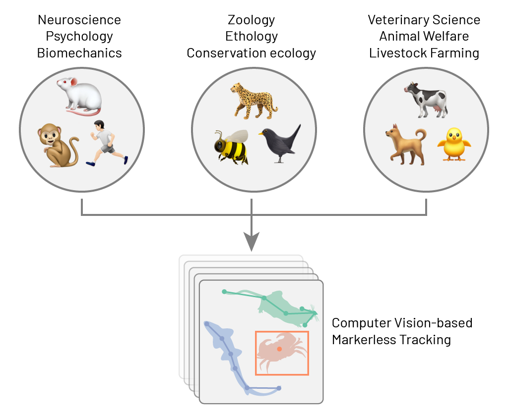{.absolute top=100 right=20  height="400"}
:::


## What happens after tracking? {.smaller}


{height="250px"}

::: {.incremental}
- Lack of standardised data formats and tools
- Lots of fragile 'in-house' scripts
- Piles of un-analysed data
:::


## movement: overview {.smaller}

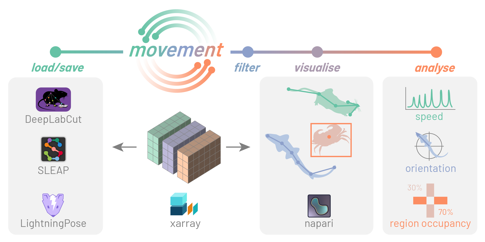{fig-align="center"}

::: footer
[movement.neuroinformatics.dev](https://movement.neuroinformatics.dev/)
:::

## movement input/output

::: {.r-stack}
::: {.fragment fragment-index=1}
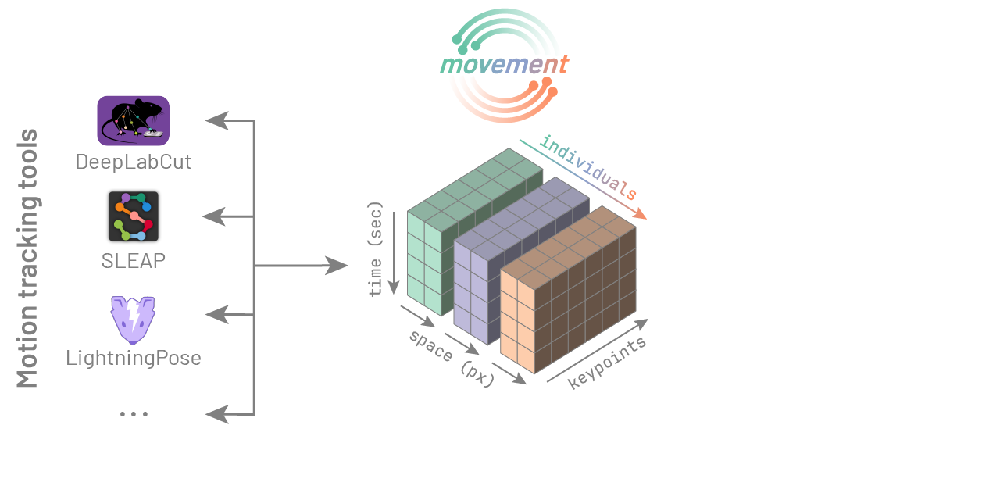{fig-align="center" width="900px"}
:::
::: {.fragment fragment-index=2}
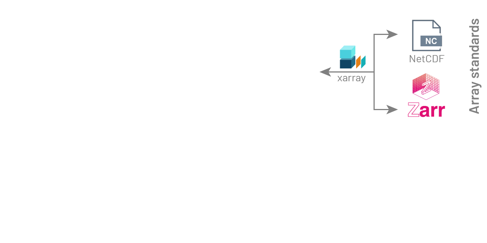{fig-align="center" width="900px"}
:::
::: {.fragment fragment-index=3}
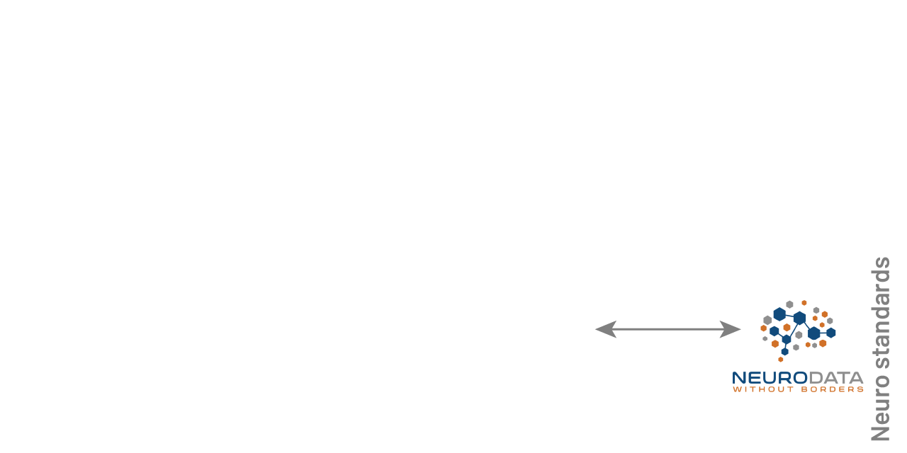{fig-align="center" width="900px"}
:::
:::

::: aside
See [movement.neuroinformatics.dev/latest/user_guide/input_output.html](https://movement.neuroinformatics.dev/latest/user_guide/input_output.html)
:::

## The movement dataset

::: {.r-stack}
::: {.fragment .fade-in-then-out fragment-index=1}
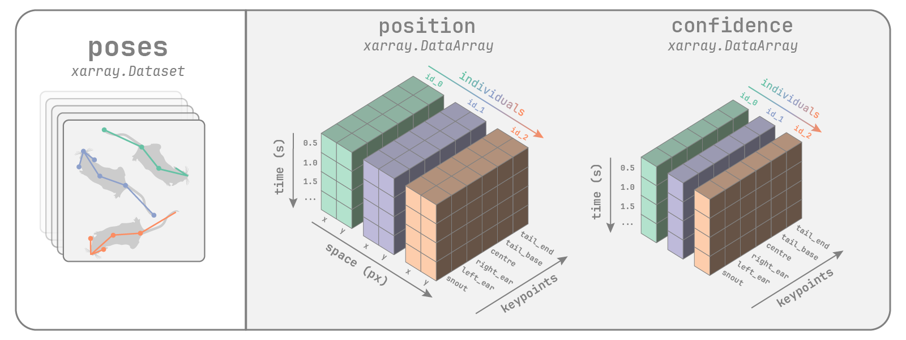{fig-align="center"}
:::
::: {.fragment fragment-index=2}
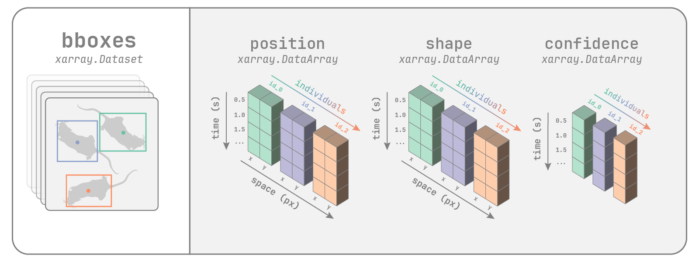{fig-align="center"}
:::
::: {.fragment fragment-index=3}
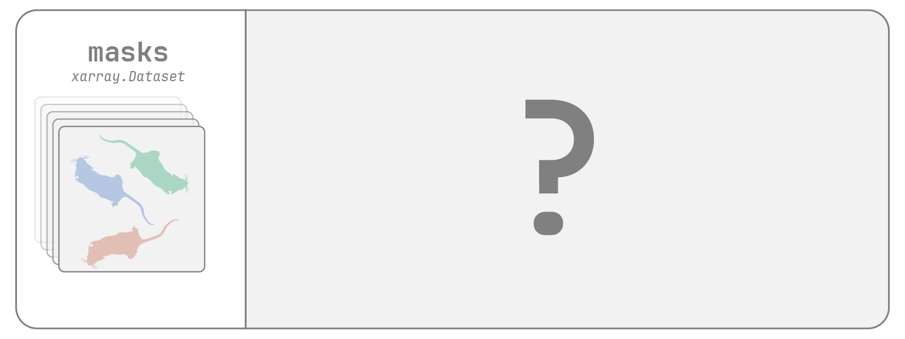{fig-align="center"}
:::
:::


::: aside
See [movement.neuroinformatics.dev/latest/user_guide/movement_dataset.html](https://movement.neuroinformatics.dev/latest/user_guide/movement_dataset.html)
:::

## Cleaning data

{height="400px" fig-align="center"}

::: aside
See [movement.neuroinformatics.dev/latest/api/movement.filtering.html](https://movement.neuroinformatics.dev/latest/api/movement.filtering.html)
:::

## Quick plots

::: {layout="[[50, 50]]"}
::: {.fragment fragment-index=1}
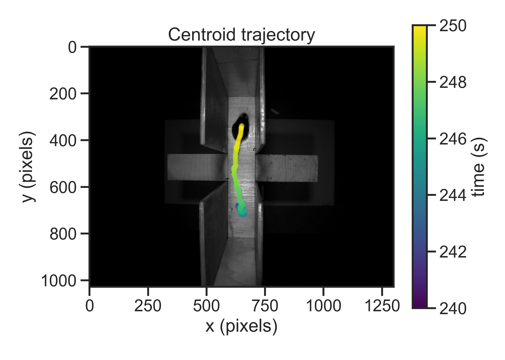
:::
::: {.fragment fragment-index=2}
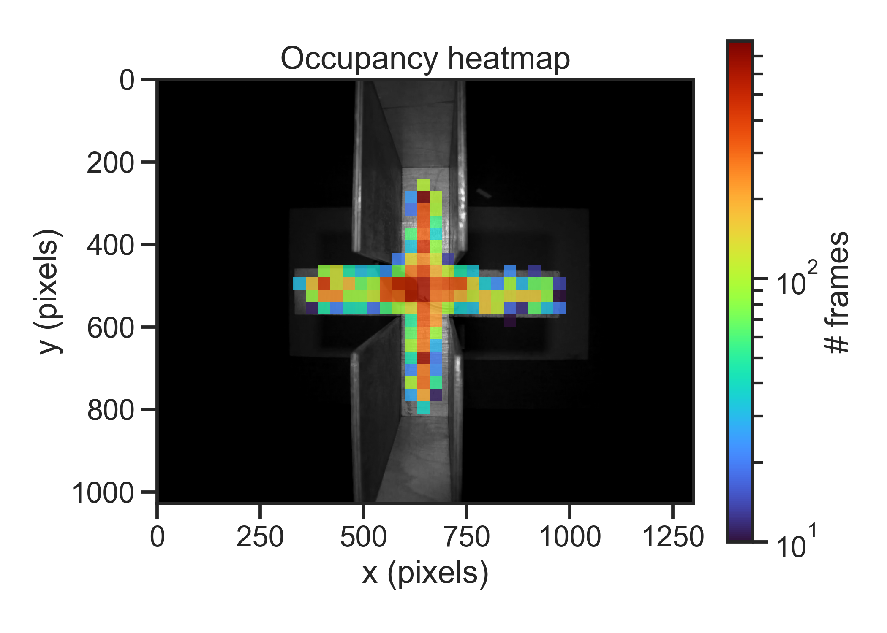
:::
:::

::: aside
See [movement.neuroinformatics.dev/latest/api/movement.plots.html](https://movement.neuroinformatics.dev/latest/api/movement.plots.html)
:::


## Quantifying motion {.smaller}

::: {.r-stack style="position: absolute; left: 0; top: 15%; width: 60%;"}
::: {.fragment fragment-index=1}
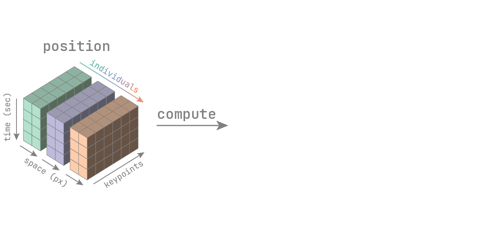{width="100%"}
:::
::: {.fragment fragment-index=2}
{width="100%"}
:::
::: {.fragment fragment-index=3}
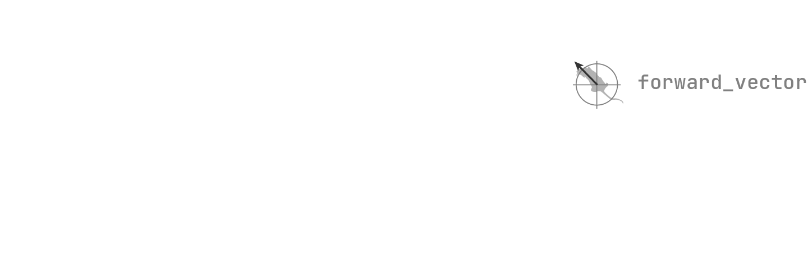{width="100%"}
:::
::: {.fragment fragment-index=4}
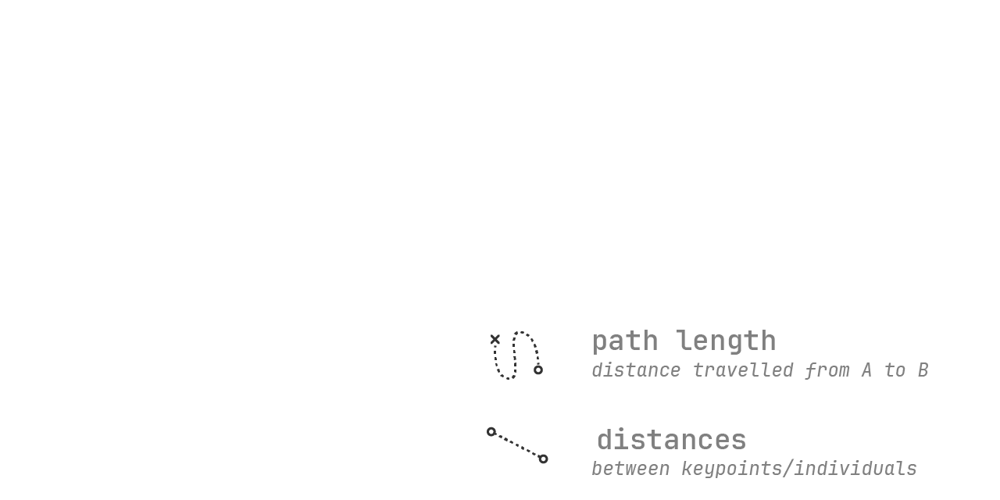{width="100%"}
:::
:::

::: {.fragment fragment-index=2 .absolute top="15%" right="0" width="40%"}
{width="100%"}
:::

::: {.fragment fragment-index=3 .absolute top="40%" right="7.5%" width="25%"}
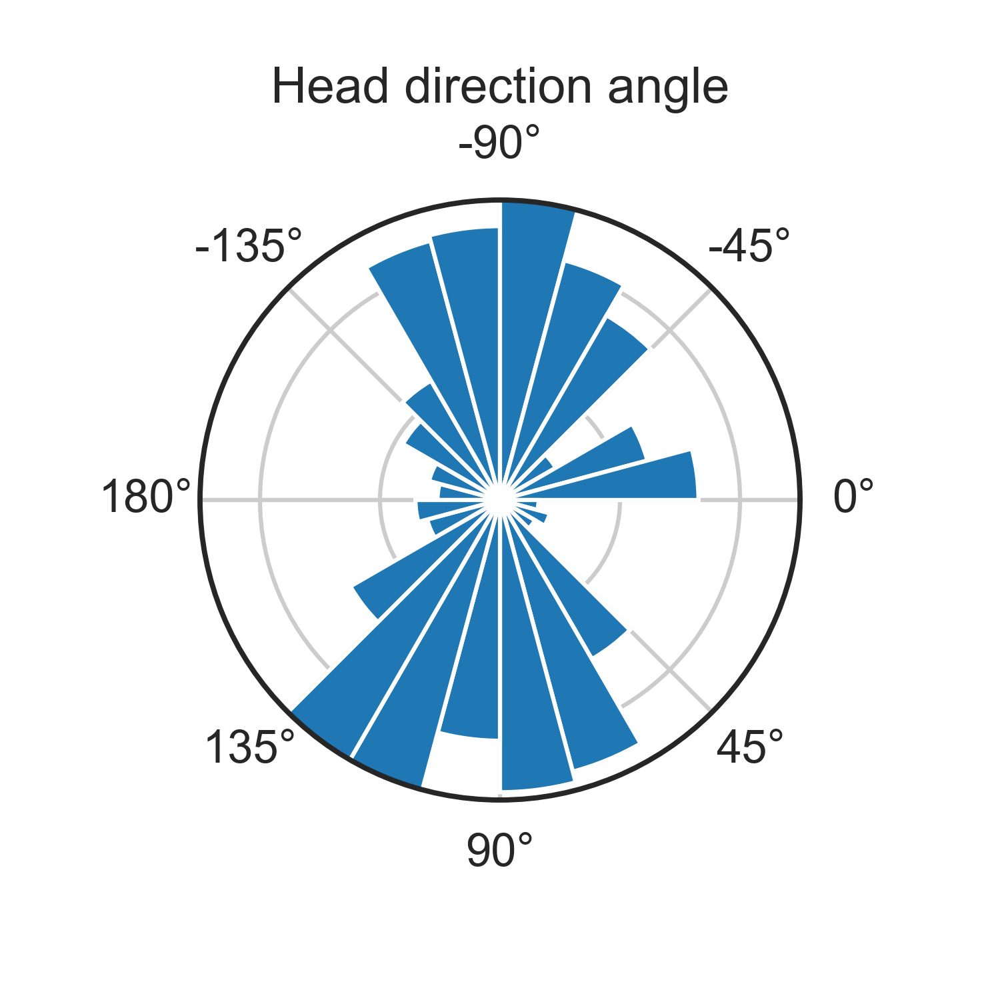{width="100%"}
:::

::: aside
See [movement.neuroinformatics.dev/latest/api/movement.kinematics.html](https://movement.neuroinformatics.dev/latest/api/movement.kinematics.html)
:::

## Scripting with movement


::: {.fragment}
```{.python code-line-numbers="5-7|9|11-13|15|17"}
from movement.io import load_dataset
from movement.filtering import rolling_filter
from movement.kinematics import compute_speed

ds = load_dataset(
  "path/to/my_data.h5", source_software="DeepLabCut", fps=30
)

ds = ds.sel(time=slice(600, 2400))

ds["position_smooth"] = rolling_filter(
  ds["position"], window=5, statistic="median"
)

ds["speed"] = compute_speed(ds["position_smooth"])

ds.to_netcdf("my_data_processed.nc")
```
:::

##

<iframe src="https://movement.neuroinformatics.dev/latest/examples/index.html" title="movement examples" style="max-height: 110%; max-width: 125%; width: 125%; height: 110%; transform: scale(0.8); transform-origin: top left;"></iframe>

::: footer
[movement.neuroinformatics.dev/latest/examples](https://movement.neuroinformatics.dev/latest/examples/index.html)
:::

## movement GUI {background-color="black"}



::: footer
[Sample data](https://movement.neuroinformatics.dev/latest/user_guide/input_output.html#sample-data): __DBTravelator__ from *Holly Morley*.
:::

## Drawing regions of interest {background-color="black"}



::: aside
Coming soon!
:::

::: footer
[Sample data](https://movement.neuroinformatics.dev/latest/user_guide/input_output.html#sample-data): __EPM__ from *Loukia Katsouri*.
:::

## Using regions of interest

:::: {columns}
::: {.column width="50%"}
::: {.fragment fragment-index=1}
- Load into  as polygons or lines
:::
::: {.fragment fragment-index=2}
- Compute distances and angles relative to regions
:::
::: {.fragment fragment-index=3}
- Compute region occupancy
:::
:::

::: {.column width="50%"}
::: {.fragment fragment-index=3}
{height="350px"}
:::
:::
::::


::: aside
See [movement.neuroinformatics.dev/latest/api/movement.roi.html](https://movement.neuroinformatics.dev/latest/api/movement.roi.html)
:::


## The bigger picture {.smaller}

::: {.r-stack}

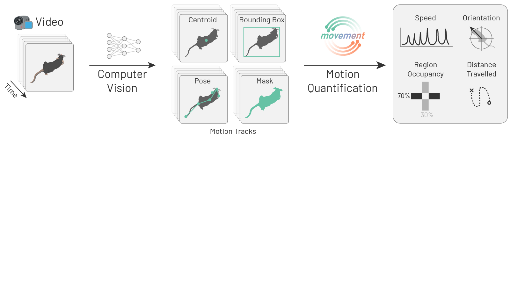{width="1000px"}

::: {.fragment}
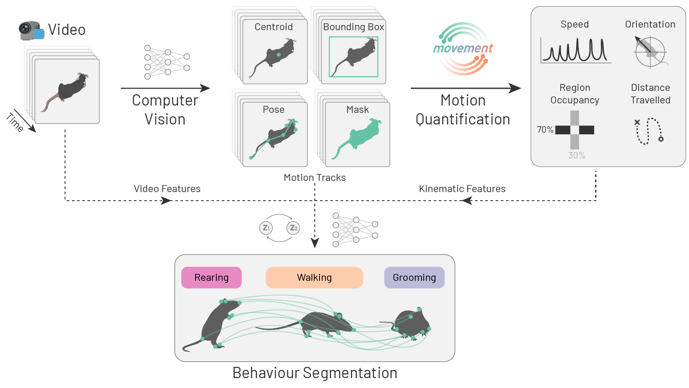{width="1000px"}
:::

:::

## Behaviour segmentation? {.smaller}

Tools can delegate input/output and feature extraction to `movement`

::: {layout="[[60, 20, -20]]" layout-valign="bottom" .fragment}
](img/VAME.gif)

](img/lisbet_logo_dark.png)
:::

::: {.fragment}
`movement` can import the behavioural labels as events of interest
:::

## Aligning data streams {.smaller}

::: {.r-stack}

{width="1000px"}

::: {.fragment}
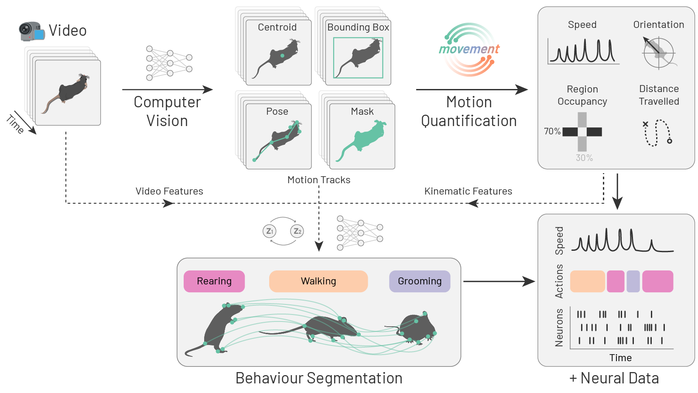{width="1000px"}
:::

:::

## The even bigger picture {.smaller}

*Long-term vision:* `movement` as the *scikit-image* for animal motion data.

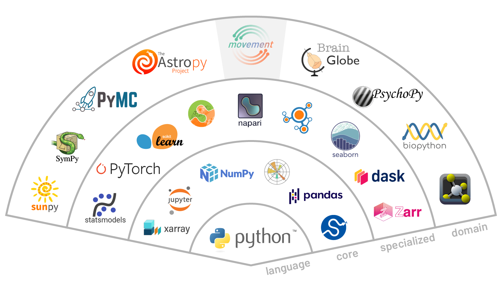{height="420px"}

::: {.fragment}

::: {.callout-tip appearance="simple"} 
If you prefer the R ecosystem, check out the [animovement](https://animovement.github.io/animovement/) toolbox
by [Mikkel Roald-Arbøl](https://roald-arboel.com).
:::

:::

## Install it now

-  Package available on PyPI and conda-forge
-  |  |  Works across OSes 
-  No dedicated GPU required


::: {.callout-tip appearance="simple"} 
See installation instructions at:

[movement.neuroinformatics.dev/latest/user_guide/installation.html](https://movement.neuroinformatics.dev/latest/user_guide/installation.html)
:::

## movement community {.smaller}

::: {.r-stack}

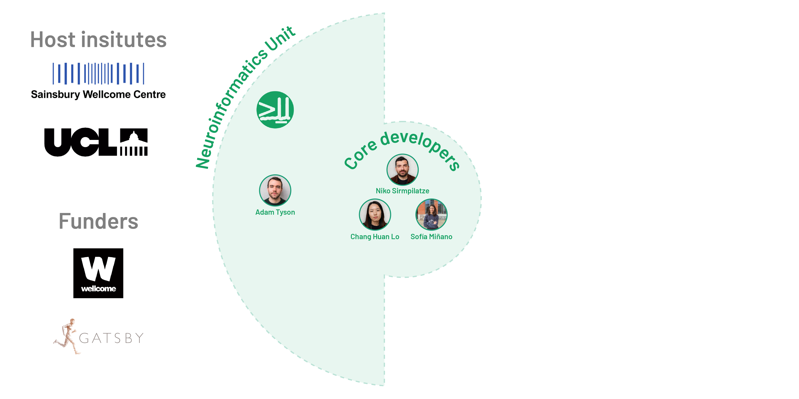{width="900px"}

::: {.fragment}
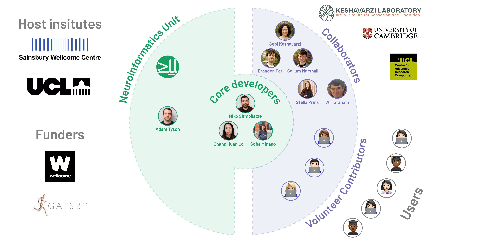{width="900px"}
:::

:::

::: {.fragment}
-  ~90k downloads (PyPI + conda-forge)
-  42 code contributors |  ~370 merged pull requests
:::

::: footer
[movement.neuroinformatics.dev/latest/community/people](https://movement.neuroinformatics.dev/latest/community/people.html)
:::


## Thank you! 🙏 {.smaller}

::: {.callout-tip appearance="simple" icon=false} 
## Join the movement!

-  [movement.neuroinformatics.dev](https://movement.neuroinformatics.dev/)
-  [github.com/neuroinformatics-unit/movement](https://github.com/neuroinformatics-unit/movement)
-  [neuroinformatics.zulipchat.com > movement](https://neuroinformatics.zulipchat.com/#narrow/stream/406001-Movement)
:::

::: {.fragment}
::: {.callout-tip appearance="simple" icon=false} 
## Animals in Motion

Annual hands-on workshop, part of our **Open Software Summer School**:

-  [animals-in-motion.neuroinformatics.dev](https://animals-in-motion.neuroinformatics.dev/dev/)
-  [neuroinformatics.dev/open-software-summer-school/](https://neuroinformatics.dev/open-software-summer-school/)
:::
:::

::: {.fragment}
::: {.callout-tip appearance="simple" icon=false} 
##  Find us online

 [Neuroinformatics Unit](https://www.linkedin.com/company/neuroinformatics-unit) |
  [neuroinformatics.dev](https://neuroinformatics.dev)


 [niksirbi](https://github.com/niksirbi) |
  [nikosirmpilatze.com](https://nikosirmpilatze.com) |
 [\@niksirbi\@neuromatch.social](https://neuromatch.social/@niksirbi)
:::
:::

## References {.smaller}

::: {#refs}
:::
